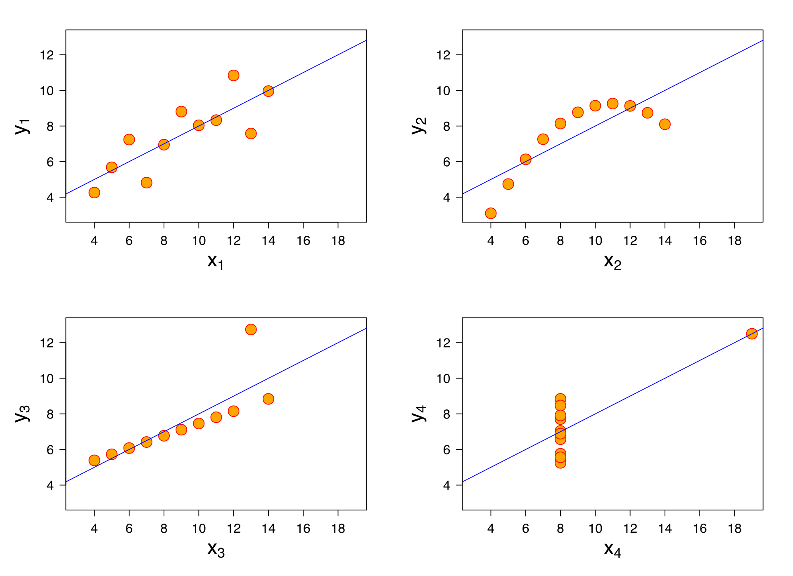

# Class 6: Data Science 1 — Pandas, SQL, Regressions

## Pandas

### What is pandas?
(adapted from [10 minutes to pandas](https://pandas.pydata.org/docs/user_guide/10min.html))

pandas is a Python library for manipulating & analyzing data. 

We usually import pandas like this:
```
import pandas as pd
```

pandas has two basic units that we care about: a `Series` and a `DataFrame`. `Series` are roughly akin to lists -- they're one-dimensional and can hold data of any type. `DataFrames` are two-dimensional (they have rows and columns) and are indexed by one or more columns. This means that a row can be identified by the labels in the index column. Each column of a `DataFrame` is also a `Series`. 

We'll focus on `DataFrames` for now. We can populate a `DataFrame` in a few different ways. First, let's instantiate a `DataFrame` with our own data. 

```
df = pd.DataFrame({
    "Name": ["Orca", "Blue Whale", "Beluga Whale", "Narwhal"],
    "Weight": [22000, 441000, 2530, 3500],
    "Cute":[True, True, True, True],
    "Habitat": ["Everywhere", "Everywhere", "Arctic", "Arctic"],
})
```

Let's look at the types the columns of `df` have: 
```
df.dtypes
```

Wow! These are a lot of different types! 

We can also access the column names like this:
```
df.columns
```

or see the first 3 entries like this:
```
df.head(3)
```

### Common Pandas operations
#### Sorting
Now we'll practice some common operations in pandas. One thing we might want to do is sort a dataframe by a particular column:
```
df.sort_values(by="Weight", ascending=False)
```

Can you sort the dataframe alphabetically by species name? 

#### Filtering
Another common thing we can do in Pandas is filtering. This means we only select the rows that match a specific condition. Let's filter for all the cetaceans whose weight is over 5000 pounds:
```
df[df.Weight > 5000]
```

Here, we're referring to the `Weight` column as an _attribute_ of our dataframe `df`. However, we can also refer to the column like we would a key in a dictionary, with the same result:
```
df[df['Weight'] > 5000]
```

Can you filter the dataframe to get all the cetaceans that live in the Arctic?

#### Adding a column
We can also add a column to the dataframe as long as it's the same length as the existing dataframe:
```
df["Food"] = ["Everything", "Krill", "Squid, Clams, Octopus, Cod, Herring", "Fish"]
```

And we can create a column from an existing column using the `apply` function:
```
def convert_from_lbs_to_kg(wt):
    return wt * 0.45
df["Weight_kg"] = df["Weight"].apply(convert_from_lbs_to_kg)
```
When we apply a function, we can use an actual function, as we did above, or we can use an _anonymous function_, or a "lambda function". 
```
df["Weight_tons"] = df["Weight"].apply(lambda b: b / 2000)
```

#### Grouping

We also might want to group our dataframe into chunks that have something in common. 

```
groups = df.groupby('Habitat')
for habitat, df_gr in groups:
    print(habitat)
    print(df_gr.head())
```

Here, we're grouping our dataframe by the `Habitat` column. `groups` is an iterable (we can iterate over the items in it, in the order given to us) that has two variables. One of them is the unique value of the column we grouped by (`Everywhere` and `Arctic`) and the other one is the chunk of the dataframe that had that unique value in that column. 

Can you group the cetaceans that weigh more than 5000 pounds apart from the ones that weigh less than 5000 pounds? (Hint: You might have to create a new column!)

### Practicing with Pandas
We can also load a pandas dataframe from a `.csv` (comma separate values) file. We're going to load up `WhaleFromSpaceDB_Whales.csv`, which we sourced from the [UK Polar Data Centre](https://ramadda.data.bas.ac.uk/repository/entry/show?entryid=c1afe32c-493c-4dc7-af9f-649593b97b2c)

```
df_whales = pd.read_csv('data/WhaleFromSpaceDB_Whales.csv')
print(df_whales.head(5))
print(df_whales.columns)
```

Let's explore the dataset a little bit! The `value_counts` function tells us how many times each unique value showed up in a column. 
```
df_whales['MstLklSp'].value_counts()
```
Now let's check for flukes! Flukes are valuable to marine biologists because they help them identify individuals. For each whale species, can you count how many times flukes were and were not seen?

What about the average certainty for each species? (Hint: `df.column.mean()` gives the average value of a column, and `Certainty2` is the column that contains the certainty score!)

## SQL

### What is SQL?
SQL stands for "__Structured Query Language__". It is a way to query a particular kind of database that has **tabular data**. 

#### What is tabular data?
Tabular data lends itself well to being organized in rows and columns. Each row represents one instance/observation, and each column represents a different attribute the instances/observations have. 

#### When is it used?
SQL is used a lot in industry to store and query data for analytic purposes. When you have a ton of data to deal with, SQL is a great way to do that. 

### How do we query an SQL table?
The most basic way to extract data from an SQL table is selecting everything:
```
SELECT * FROM table;
```
This will get us everything in `table`, so sometimes it's not a good idea to pull **all the data**. In this case, we can set a limit of 5 entries:
```
SELECT * FROM table LIMIT 5;
```
But what if we want to filter our data? In this example, we select all entries from the table named `table` that have a value in `column` greater than 5:
```
SELECT * FROM table WHERE column > 5;

```

Or if we want to select based on multiple conditions, we can do this:
```
SELECT * FROM table WHERE column1 > 5 AND column2 < 3;

```

And if we don't want duplicate rows, we can use `SELECT DISTINCT`: 
```
SELECT DISTINCT * FROM table WHERE column1 > 5 AND column2 < 3;

```
### Aggregation
Just like in pandas, sometimes we might want aggregated information about our tables. 
In this case, we can use `GROUP BY` and aggregation functions. 

```
SELECT mean(column1), max(column2) FROM table GROUP BY column3;

```
Here, we're grouping our table by the unique values in `column3`. Then, for each unique value in `column3`, we're going to grab the average value that `column1` takes and the max value of `column2`. This allows us to get aggregate information about our data!

### Practicing an SQL Query on the Cluster

## Regressions

### What is a regression?
Regressions are used to figure out how variables in a dataset are related to each other. Usually, you have a dependent variable (the __outcome__ we care about) and some set of __independent variables__ that influence the outcome. For example, let's say we have a bunch of fish and their dimensional measurements. We want to figure out how much the fish weighs, given its measurements. Regression is one way we can do this!

In its most basic form, a linear regression will try to minimize the __sum of squared error__. Let's say we have a bunch of observations $y_i$ and $\vec{X_i}$. Each $y_i$ is a numeric value, and each $X_i$ is a vector of dependent variables. We want to find a vector $\vec{\beta}$ such that $\sum_{i=0}^{n} (\vec{\beta} x_i - y_i)^2$ is minimized. This is also referred to the sum of the squares of the residuals -- __residual__ is another word for how incorrect an individual prediction is. In aggregate, we want the amount that we are wrong to be as small as possible. 

We often use $R^2$, or the ["coefficient of determination,"](https://en.wikipedia.org/wiki/Coefficient_of_determination)  to estimate how well a regression explains data. Formally, it takes the following form:
$SS_{res} = \sum_{i=0}^{n} (\vec{\beta} x_i - y_i)^2$ is the sum of the squares of the __residuals__ (remember, this is how wrong an individual prediction is).
$SS_{tot} = \sum_{i=0}^{n} (y_i - \bar{y})^2$ is the __total sum of squares__ - this is proportional to the variance of the dataset. 

Now, $R^2 = 1 - \frac{SS_{res}}{SS_{tot}}$. In other words, we're asking "how big is our error compared to all the variance in the dataset?"

#### When are regressions useful?
Regressions are useful for figuring out how different independent variables affect a dependent variable. They are also helpful in predicting how a system might act in the future. For example, if you have a lot of fish and a linear regression model that can predict their weights pretty well, you can then measure even more fish and predict their weights! 
#### When do they fall short?
Sometimes data isn't linear! Other times, you might have something that looks like a good fit, but it doesn't explain your data well. [Anscombe's Quartet](https://en.wikipedia.org/wiki/Anscombe%27s_quartet) is a good example that explains why just going ahead and fitting a linear model to your data may not always be wise! 



As you can see, these datasets are doing very different things, but the linear model that best describes them is the same for all four datasets. It also fits each dataset as well as the next: the $R^2$ is $0.67$ for all the regressions. This is a cautionary tale: sometimes a linear model is simply not the right model!

### Running a linear regression on a Pandas dataframe

#### Setting up the dataset
Now we're going to load another CSV; this time, it will be full of fish measurements that we will attempt to correlate to the fishes' weights. 

```
df_fish = pd.read_csv('data/Fish.csv')
df_fish.head(5)
```

First, we'll try doing a basic regression with sklearn. We need to make two `numpy` arrays for the linear regression module to use. So we're going to learn how to grab `numpy` arrays from a pandas dataframe. We'll use the columns `Length1`, `Length2`, `Length3`, `Height`, and `Width` as our _independent variables_. Our _dependent variable_, of course,  is `Weight`. 

To get a subset of columns from a dataframe, we simply list the columns we want. then call the `.to_numpy()` function. This converts our dataframe into a numeric numpy array:

```
col_subset = df_fish[['Length1', 'Length2', 'Length3', 'Height', 'Width']]
x_mtx = col_subset.to_numpy()

```

Can you figure out how to obtain the array of fish weights?


#### Importing `sklearn`
`sklearn`, or [scikit-learn](https://scikit-learn.org/stable/index.html), is a Python package that has a bunch of machine learning algorithms built in. We're going to use it to practice running linear regressions. 

```
from sklearn import linear_model
reg = linear_model.LinearRegression()
reg.fit(x_mtx, y_mtx)

```
We have created a `LinearRegression` object, called `reg`. When we call the `fit()` method, we compute the best coefficients to multiply the values in `x_mtx` by to get something close to `y_mtx`. How good is our model? The `score()` method gives us $R^2$. 
```
reg.score(x_mtx, y_mtx)

```
That's not too bad!

#### Adding in Fish Species
What if our fish are different densities depending on species? Let's see if we can make our regression a little better. One way to do this is to introduce a _categorical variable_. In this case, we'll have a column for each fish species. Its entry for each row will take the value $1$ if the fish in that row is of that species; otherwise, it'll be $0$. This is really easy to do with `pandas`:
```
df_fish["fish_category"] = df_fish["Species"].astype("category")
fish_dummies = pd.get_dummies(df_fish['fish_category'], prefix='species_')

```
We've created what's called one-hot encodings, or dummmy variables, which is great news for our fish regression! Let's create a matrix of species dummy variables:
```
species_mtx = fish_dummies.to_numpy()

```
And now we'll concatenate that (along the horizontal axis) to our original matrix of fish measurements:
```
x_new = np.hstack([species_mtx, x_mtx])

```

We'll make a new regression object:
```
reg1 = linear_model.LinearRegression()
reg1.fit(x_new, y_mtx)

```

How did we do??
```
reg1.score(x_new, y_mtx)

```
That's better! Adding more information doesn't always help, but this time around it did!

#### Getting Fancy
We can also use something called a *kernel function* to transform our linear data into higher dimensional space. Specifically, we can apply arbitrary functions to our fish data and add them to our linear regression matrices. Let's say we have two concentric circles as a dataset:

We're going to have a hard time separating these with either of their $x$ and $y$ coordinates! But what if we add a new column that is $\sqrt{x_i^2 + y_i^2}$? We're able to separate them easily because we've projected our points into a higher dimensional space. Neat!!

Let's try applying this to the fish dataset. Can you engineer a new column for the fish dataset that improves your $R^2$?

