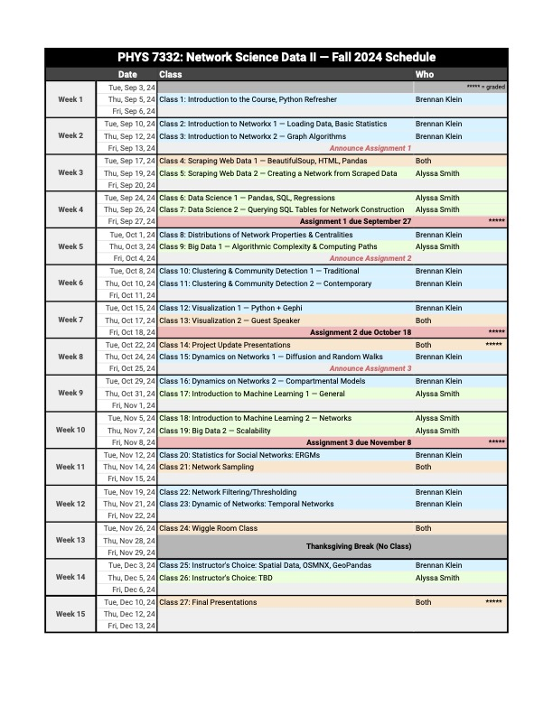

# Welcome to PHYS 7332 (Network Science Data)

## Course Overview
This course offers an introduction to network analysis and is designed to provide students with an overview of the core data scientific skills required to analyze complex networks. Through hands-on lectures, labs, and projects, students will learn actionable skills about network analysis techniques using Python (in particular, the `networkx` library). The course network data collection, data input/output, network statistics, dynamics, and visualization. Students also learn about random graph models and algorithms for computing network properties like path lengths, clustering, degree distributions, and community structure. In addition, students will develop web scraping skills and will be introduced to the vast landscape of software tools for analyzing complex networks. The course ends with a large-scale final project that demonstrates the proficiency of the students in network analysis. This course is cross-listed as NETS 7332.

This syllabus will be updated and can be found [here](https://brennanklein.com/nets7332-fall24)

## Course Learning Outcomes:
- Proficiency in Python and `networkx` for network analysis.
- Strong foundation of complex network algorithms and their applications.
- Skills in statistical description of networks.
- Experience in collecting and analyzing online data.
- Broad knowledge of various network libraries and tools.

## Materials:
There are no required materials for this course, but we will periodically draw from:
- Bagrow & Ahn (2024). __**Working with Network Data: A Data Science Perspective**__. Cambridge University Press; 1st Edition; 978-1009212595. [https://www.cambridge.org/network-data](https://www.cambridge.org/network-data)

Additionally, we recommend engagement with other useful network science and/or Python materials:
- Barabási (2016). __**Network Science**__. Cambridge University Press; 1st Edition; 978-1107076266. [http://networksciencebook.com/](http://networksciencebook.com/)
- Newman (2018). __**Networks: An Introduction**__. Oxford University Press; 2nd Edition; 978-0198805090. [https://global.oup.com/academic/product/networks-9780198805090](https://global.oup.com/academic/product/networks-9780198805090)
- Barrat, Barthelemy, & Vespignani (2008). __**Dynamical Processes on Complex Networks**__. Cambridge University Press; 1st Edition; 978-0511791383. [https://doi.org/10.1017/CBO9780511791383](https://doi.org/10.1017/CBO9780511791383)
- VanderPlas (2019). __**Python Data Science Handbook**__. O'Reilly Media, Inc; 978-1491912058. [https://github.com/jakevdp/PythonDataScienceHandbook](https://github.com/jakevdp/PythonDataScienceHandbook)

## Coursework, Class Structure, and Grading:
This is a twice-weekly hands-on class that emphasizes building experience with coding. This does not necessarily mean every second of every class will be live-coding, but it will inevitably come up in how the class is taught. We are often on the lookout for improving the pedagogical approach to this material, and we would welcome feedback on class structure. The course will be co-taught, featuring lectures from the core instructors as well as outside experts. Grading in this course will be as follows:
- Class Attendance & Participation: 10%
- Problem Sets: 45%
- Mid-Semester Project Presentation: 15%
- Final Project - Presentation & Report: 30%

## Final Project
The final project for this course is a chance for students to conduct original research on a network dataset, putting the skills learned in class to practice. Students will focus on a dataset that either 1) is a network that they collected themselves (e.g.~scraped from online, etc.), or 2) is a temporal network with many snapshots through time, or 3) consists of an \textit{ensemble} of networks (e.g.~a collection of hundreds of brain networks from an online repository). Students will conduct a basic analysis of the dataset (degree distribution(s), clustering, assortativity, centralities, etc.), in addition to other modeling tasks (simulating dynamical processes, statistical modeling, mechanistic modeling, etc.). These analyses must serve a broader interpretive discussion about how and why network science tools were used to advance new knowledge about the system and its context.

## Instructors
**Brennan Klein** is an associate research scientist at the Network Science Institute, with a joint affiliation at the Institute for Experiential AI. He is the director of the Complexity & Society Lab. His research spans two broad topics: 1) Information, emergence, and inference in complex systems -- developing tools and theory for characterizing dynamics, structure, and scale in networks, and 2) Public health and public safety -- creating and analyzing large-scale datasets that reveal inequalities in the United States, from epidemics to mass incarceration. Dr.Klein received a PhD in Network Science in 2020 from Northeastern University and got his BA in Cognitive Science & Psychology from Swarthmore College in 2014. Website: [http://brennanklein.com/](brennanklein.com).

**Alyssa Smith** is a fourth-year PhD student in Network Science at Northeastern University. Her current work focuses on the ways that structure and agency interact in social networks to encourage mobilization. She is interested in making big data and computational tools usable by academics without specialized technical training. She use mixed methods, ranging from terabyte-scale datasets to autoethnography, to make sense of the world. Her dissertation work revolves around __structure__  -- the place one occupies in a social network -- and __agency__ -- an individual’s characteristics and proclivities -- which are thought to be the two main driving forces behind engagement in social movements. We can think of structure and agency as two separate, competing factors, or we can think of them as a duality: in much the same way that light is both a particle and a wave, the interplay of structure and agency is what governs mobilization. Before joining the Network Science Institute, Alyssa received a BS in Humanities and Engineering with Comparative Media Studies and Computer Science from MIT in 2017; after that, she worked in tech for 4 years. Website: [https://asmithh.github.io/](https://asmithh.github.io/).


```{tableofcontents}
```
